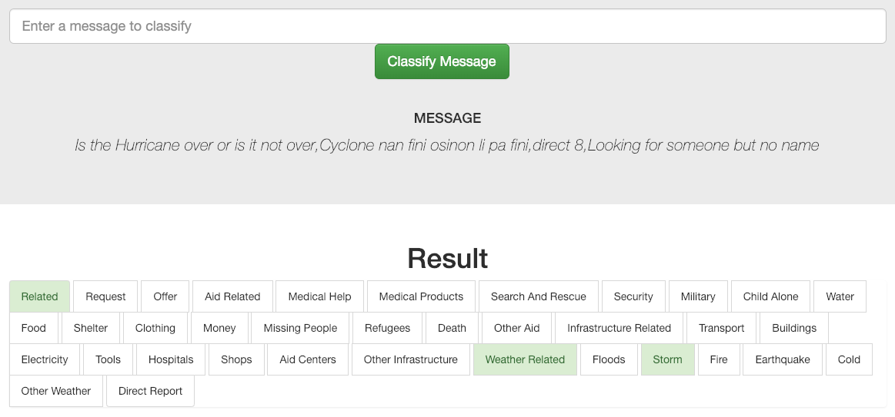

# Disaster Response Pipeline Project

### Summary:
This project contains real messages that were sent during disaster events. It creates a machine learning pipeline to categorize these events into 36 categories, in help to send messages to an appropriate disaster relief agency.




### Instructions:
1. Run the following commands in the project's root directory to set up your database and model.

- To run ETL pipeline that cleans data and stores in database
    ```bash
    python data/process_data.py data/disaster_messages.csv data/disaster_categories.csv data/DisasterResponse.db
    ```
- To run ML pipeline that trains classifier and saves
    ```bash
    python models/train_classifier.py data/DisasterResponse.db models/classifier.pkl
    ```

2. Run the following command in the app's directory to run your web app.
    ```bash
    python run.py`
    ```

3. Go to http://0.0.0.0:3001/


### Files: 
- app
    - template
    - master.html  # main page of web app
        - go.html  # classification result page of web app
        - run.py  # Flask file that runs app

- data
    - disaster_categories.csv  # data to process 
    - disaster_messages.csv  # data to process
    - process_data.py
    - InsertDatabaseName.db   # saved clean data (not included, generated by process_data.py)

- models
    - train_classifier.py
    - classifier.pkl  # saved model (not included, generated by train_classifier.py)

- README.md